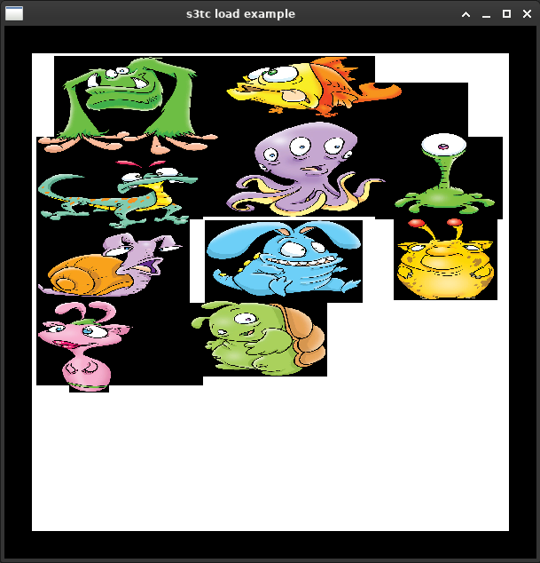

# s3tc_test
Simple test program to test GL_EXT_TEXTURE_COMPRESSION_S3TC features

## Prerequisite
  * cmake at least at versione 3.1
  * c++14 conformant compiler (GCC 5: used features: make_unique and uniform initalization)
  * glew
  * glfw3

### Ubuntu 16.04 and newer
```
sudo apt install cmake libglew-dev libglfw3-dev
```

### Ubuntu 14.04 and older
GLFW3 unfortunately it's not present in default repository. Follow these instructions:
```
sudo add-apt-repository ppa:keithw/glfw3
sudo apt-get update
sudo apt-get install cmake libglew-dev libglfw3-dev
```

The default cmake version is 2.8 so you have to download a newer version from cmake website

## Build and run on Linux
Build:
```
mkdir build
cd build
cmake ..
make
```
Run:
```
./s3tc_test
```
or
```
LIBGL_ALWAYS_SOFTWARE=1 ./s3tc_test
```

## Result

